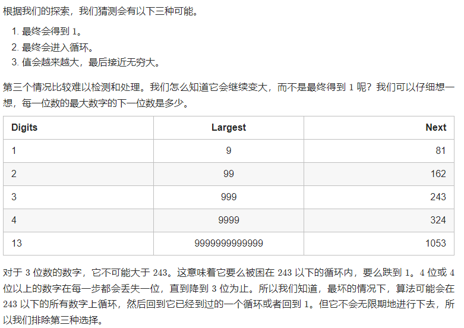

## 快乐数

### 题目描述

判断一个数 n 是不是快乐数。

「快乐数」 定义为：

```c++
对于一个正整数，每一次将该数替换为它每个位置上的数字的平方和。
然后重复这个过程直到这个数变为 1，也可能是 无限循环 但始终变不到 1。
如果这个过程 结果为 1，那么这个数就是快乐数。
如果 n 是 快乐数 就返回 true ；不是，则返回 false 。
```

### 思路

 

**方法一：哈希表**

使用哈希法，来判断这个sum是否重复出现，如果重复了就是return false， 否则一直找到sum为1为止。

判断sum是否重复出现就可以使用unordered_set。

```cpp
class Solution {
public:
    // 取数值各个位上的单数之和
    int getSum(int n) {
        int sum = 0;
        while (n) {
            sum += (n % 10) * (n % 10);
            n /= 10;
        }
        return sum;
    }
    bool isHappy(int n) {
        unordered_set<int> set;
        while(1) {
            int sum = getSum(n);
            if (sum == 1) {
                return true;
            }
            // 如果这个sum曾经出现过，说明已经陷入了无限循环了，立刻return false
            if (set.find(sum) != set.end()) {
                return false;
            } else {
                set.insert(sum);
            }
            n = sum;
        }
    }
};
```

**方法二：快慢指针**

思路与 *判断链表是否有环* 相似。

```cpp
class Solution {
public:
    int bitSquareSum(int n) {
        int sum = 0;
        while(n > 0)
        {
            int bit = n % 10;
            sum += bit * bit;
            n = n / 10;
        }
        return sum;
    }
    
    bool isHappy(int n) {
        int slow = n, fast = n;
        do{
            slow = bitSquareSum(slow);
            fast = bitSquareSum(bitSquareSum(fast));
        }while(slow != fast);
        
        return slow == 1;
    }
};
```

