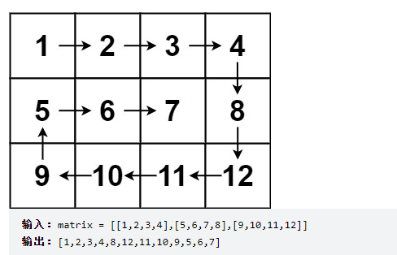
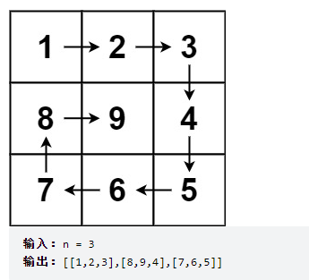

## 螺旋矩阵①

### 描述

给你一个 `m` 行 `n` 列的矩阵 `matrix` ，请按照 **顺时针螺旋顺序** ，返回矩阵中的所有元素。

### 示例



### 思路

1. 首先设定上下左右边界
2. 其次向右移动到最右，此时第一行因为已经使用过了，可以将其从图中删去，体现在代码中就是重新定义上边界
3. 判断若重新定义后，上下边界交错，表明螺旋矩阵遍历结束，跳出循环，返回答案
4. 若上下边界不交错，则遍历还未结束，接着向下向左向上移动，操作过程与第一，二步同理
5. 直到任意边界交错，退出循环

```cpp
class Solution {
public:
    vector<int> spiralOrder(vector<vector<int>>& matrix) {
        vector<int> res;
        int left = 0, right = matrix[0].size()-1, top = 0, bottom = matrix.size()-1;
        int num = 0;
        int i, j;
        while(true){
            for(i = top, j = left; j <= right; ++j) res.push_back(matrix[i][j]);    
            if(++top > bottom) break;
            for(i = top, j = right; i <= bottom; ++i) res.push_back(matrix[i][j]);
            if(--right < left) break;
            for(i = bottom,  j = right; j >= left; --j) res.push_back(matrix[i][j]);
            if(--bottom < top) break;
            for(i = bottom, j = left; i >= top; --i) res.push_back(matrix[i][j]);
            if(++left > right) break;
        }
        return res;
    }
};
```


## 螺旋矩阵②

### 描述

给你一个正整数 `n` ，生成一个包含 `1` 到 `n2` 所有元素，且元素按顺时针顺序螺旋排列的 `n x n` 正方形矩阵 `matrix` 。

### 示例



### 思路

**方法一：顺时针放入元素**

+ 定义上下左右边界， `left`代表最左边和最上边的边界，`right`代表最右边和最下边的边界。

+ 模拟顺时针：左闭右闭，上开下闭，右开左闭，下开上开。

+ 每一次顺时针结束，上下左右边界都要向中间缩放1。

```cpp
class Solution {
public:
    vector<vector<int>> generateMatrix(int n) {
        vector<vector<int> > res(n, vector<int>(n));
        int left = 0, right = n-1; //left代表左上边界，right代表右下边界
        int num = 0; //num用来填充数组
        int i, j;
        while(left <= right){
            for(i = left, j = left; j <= right; ++j)
                res[i][j] = ++num;
            for(i = left+1, j = right; i <= right; ++i)
                res[i][j] = ++num;
            for(i = right, j = right-1; j >= left; --j)
                res[i][j] = ++num;
            for(i = right-1, j = left; i > left; --i)
                res[i][j] = ++num;
            ++left;
            --right;
        }
        return res;
    }
};
```

根据代码随想录优化 -- 一为左闭右开区间，如果n为奇数，最中间元素需要特殊处理。

```C++
class Solution {
public:
    vector<vector<int>> generateMatrix(int n) {
        vector<vector<int> > res(n, vector<int>(n));
        int left = 0, right = n-1;
        int num = 0;
        int i, j;
        while(left < right){
            for(i = left, j = left; j < right; ++j)
                res[i][j] = ++num;
            for(i = left; i < right; ++i)
                res[i][j] = ++num;
            for(; j > left; --j)
                res[i][j] = ++num;
            for(; i > left; --i)
                res[i][j] = ++num;
            ++left;
            --right;
        }
        if(n%2 == 1) res[left][right] = ++num; 
        return res;
    }
};
```


**方法二：《代码随想录》思路 -- 顺时针放入元素**

统一为左闭右开区间

```cpp
class Solution {
public:
    vector<vector<int>> generateMatrix(int n) {
        vector<vector<int>> res(n, vector<int>(n, 0)); // 使用vector定义一个二维数组
        int startx = 0, starty = 0; // 定义每循环一个圈的起始位置
        int loop = n / 2; // 每个圈循环几次，例如n为奇数3，那么loop = 1 只是循环一圈，矩阵中间的值需要单独处理
        int mid = n / 2; // 矩阵中间的位置，例如：n为3， 中间的位置就是(1，1)，n为5，中间位置为(2, 2)
        int count = 1; // 用来给矩阵中每一个空格赋值
        int offset = 1; // 每一圈循环，需要控制每一条边遍历的长度
        int i,j;
        while (loop --) {
            i = startx;
            j = starty;

            // 下面开始的四个for就是模拟转了一圈
            // 模拟填充上行从左到右(左闭右开)
            for (j = starty; j < starty + n - offset; j++) {
                res[startx][j] = count++;
            }
            // 模拟填充右列从上到下(左闭右开)
            for (i = startx; i < startx + n - offset; i++) {
                res[i][j] = count++;
            }
            // 模拟填充下行从右到左(左闭右开)
            for (; j > starty; j--) {
                res[i][j] = count++;
            }
            // 模拟填充左列从下到上(左闭右开)
            for (; i > startx; i--) {
                res[i][j] = count++;
            }

            // 第二圈开始的时候，起始位置要各自加1， 例如：第一圈起始位置是(0, 0)，第二圈起始位置是(1, 1)
            startx++;
            starty++;

            // offset 控制每一圈里每一条边遍历的长度
            offset += 2;
        }

        // 如果n为奇数的话，需要单独给矩阵最中间的位置赋值
        if (n % 2) {
            res[mid][mid] = count;
        }
        return res;
    }
};
```