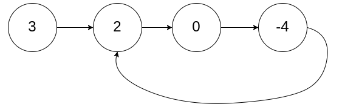
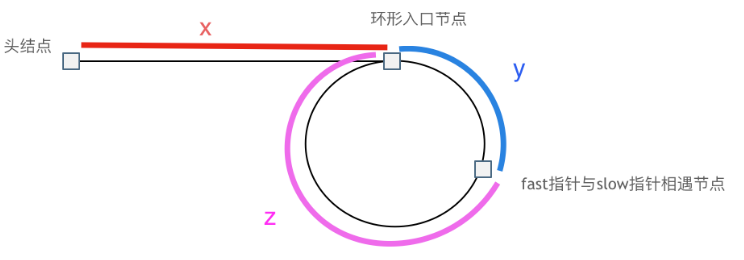

## 环形链表

### 题目描述

给定一个链表的头节点  `head` ，返回链表开始入环的第一个节点。 *如果链表无环，则返回 `null`。*



### 思路

方法一：哈希表存放访问过的节点

```c++
class Solution {
public:
    ListNode *detectCycle(ListNode *head) {
        unordered_set<ListNode *> visited;
        while (head != nullptr) {
            if (visited.count(head)) {
                return head;
            }
            visited.insert(head);
            head = head->next;
        }
        return nullptr;
    }
};
```


方法二：快慢指针

方程组：快指针走过的路程是慢指针的两倍 `f = 2(x+y)` 

​				快指针比慢指针多走n圈环状链表 `f = x + y + n*(y+z)`

解得：`x = z + (n-1) * (y + z)`

那么快慢指针相遇后，再设置两个指针，一个从相遇点出发，一个从head出发，那么到入口节点，两个指针就会相遇在入口处。



```c++
class Solution {
public:
    ListNode *detectCycle(ListNode *head) {
        ListNode *slow = head, *fast = head;
        while(fast != NULL && fast -> next != NULL){
            slow = slow -> next;
            fast = fast -> next -> next;
            if(slow == fast){
                fast = head;
                while(slow != fast){
                    slow = slow -> next;
                    fast = fast -> next;
                }
                return slow;
            }
        }
        return NULL;
    }
};
```

